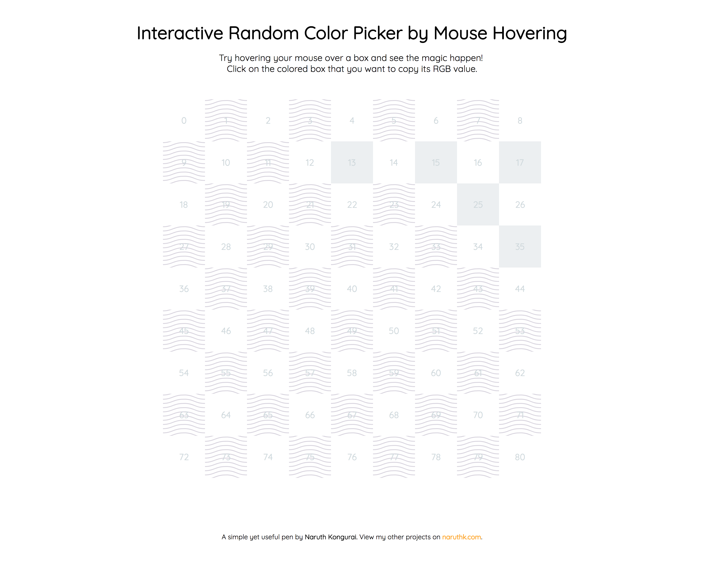

# Interactive Random Color Picker by Mouse Hovering

This app allows you to randomly pick a color from any of the tiles shown on the screen. To select the color that you've found, just click on the tile and viola! That's it!

**Note** that the output of the color that you've just copied to the clipboard will be in RGB format.

## Demo

See the demo of it by clicking on this link: [https://naruthk.github.io/web-fun-color-picker/demo/](https://naruthk.github.io/web-fun-color-picker/demo/)

See the code on CodePen: [https://codepen.io/naruthk/pen/LzMwWJ](https://codepen.io/naruthk/pen/LzMwWJ)

## Screenshot

